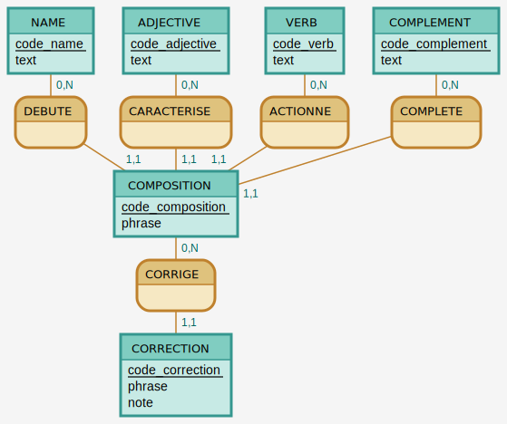

# BDD

## MCD & MLD

### MCD

via Mocodo

```
NAME: code_name, text
ADJECTIVE: code_adjective, text
VERB: code_verb, text
COMPLEMENT: code_complement, text

DEBUTE, 0N NAME, 11 COMPOSITION
CARACTERISE, 0N ADJECTIVE, 11 COMPOSITION
ACTIONNE, 0N VERB, 11 COMPOSITION
COMPLETE, 0N COMPLEMENT, 11 COMPOSITION

COMPOSITION: code_composition, phrase

CORRIGE, 11 CORRECTION, 0N COMPOSITION

CORRECTION: code_correction, phrase, note
```



### MLD

- name (<ins>id</ins>, text)
- adjective (<ins>id</ins>, texte)
- verb (<ins>id</ins>, texte)
- complement (<ins>id</ins>, texte)
- composition (<ins>id</ins>, phrase, #name(id), #adjective(id), #verb(id), #complement(id))
- correction (<ins>id</ins>, phrase, note, #composition(id))
