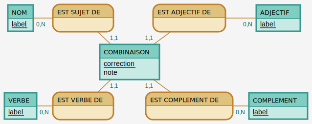

# BDD

## MCD & MLD

### MCD

via Mocodo

```
NOM: label
EST SUJET DE, 0N NOM, 11 COMBINAISON
:
EST ADJECTIF DE, 0N ADJECTIF, 11 COMBINAISON
ADJECTIF: label

:
COMBINAISON: correction, note

VERBE: label
EST VERBE DE, 0N VERBE, 11 COMBINAISON
:
EST COMPLEMENT DE, 0N COMPLEMENT, 11 COMBINAISON
COMPLEMENT: label
```



### MLD

- nom (<ins>id</ins>, texte)
- adjectif (<ins>id</ins>, texte)
- verbe (<ins>id</ins>, texte)
- complement (<ins>id</ins>, texte)
- combinaison (<ins>id</ins>, correction, note, #nom(id), #adjectif(id), #verbe(id), #complement(id))
